<div align="center">

<!-- Typing SVG -->
[](https://git.io/typing-svg)


</div>

---

<div align="center">

# 🧠 HESHAM HAROON | Neural Architecture

```ascii
    ╔════════════════════════════════════════════════════════════════╗
    ║                    TRANSFORMER ARCHITECTURE                    ║
    ║                        [Self-Attention]                        ║
    ║                              ▲                                 ║
    ║                              │                                 ║
    ║         ┌────────────────────┼────────────────────┐           ║
    ║         │                    │                    │           ║
    ║    [GenAI Layer]      [NLP Engine]      [Agentic LLM]        ║
    ║         │                    │                    │           ║
    ║         └────────────────────┼────────────────────┘           ║
    ║                              │                                 ║
    ║                    [Embedding Layer: 768d]                     ║
    ║                              │                                 ║
    ║              [Input: AI Team Lead @ ECC Egypt]                 ║
    ╚════════════════════════════════════════════════════════════════╝
```

### 🚀 AI Team Lead @ Egyptian Company For Cosmetics (ECC)
**Cairo, Egypt 🇪🇬 | 4+ Years Engineering AI Solutions**

[](https://protofolio-production.up.railway.app/)
[](https://linkedin.com/in/hesham-haroon)
[](mailto:heshamharoon19@gmail.com)
[](https://github.com/h9-tec)

</div>

---

## 📑 Table of Contents

- [💡 About Me](#-about-me)
- [📊 GitHub Statistics](#-github-statistics)
- [🔬 Research & Innovation](#-research--innovation)
- [💼 Professional Journey](#-professional-journey)
- [🛠️ Technical Arsenal](#️-technical-arsenal)
- [🚀 Core Competencies](#-core-competencies)
- [🏆 Achievements & Trophies](#-achievements--trophies)
- [⚡ Recent Activity](#-recent-activity)
- [🎓 Credentials](#-credentials)
- [🌐 Connect With Me](#-connect-with-me)

---

## 💡 About Me

```python
class HeshamHaroonAI:
    """
    Advanced Agentic AI System - Production Grade
    Architecture: Transformer-based Neural Network with Multi-Head Attention
    Status: Actively Learning & Deploying at Scale
    """

    def __init__(self):
        self.role = "AI Team Lead"
        self.organization = "Egyptian Company For Cosmetics (ECC)"
        self.location = "Cairo, Egypt 🇪🇬"
        self.mode = "PRODUCTION"

        # Core Configuration
        self.config = {
            "model_type": "Agentic Transformer",
            "attention_heads": 12,
            "hidden_size": 768,
            "num_layers": 24,
            "vocabulary_size": "∞",
            "learning_rate": "adaptive",
            "optimization": "AdamW + Curiosity-Driven Exploration"
        }

        # Technical DNA
        self.languages = {
            "python": {"proficiency": "98%", "years": 4, "status": "native"},
            "sql": {"proficiency": "92%", "years": 3, "status": "fluent"},
            "javascript": {"proficiency": "88%", "years": 2, "status": "fluent"},
            "typescript": {"proficiency": "85%", "years": 2, "status": "conversational"}
        }

        self.specializations = [
            "🧬 Generative AI (GPT-4, Claude, Gemini)",
            "🤖 Agentic LLM Systems (AutoGPT, LangGraph)",
            "🗣️ Natural Language Processing (BERT, T5, XLM-R)",
            "📊 Machine Learning & Deep Learning",
            "🏗️ AI Solutions Architecture",
            "💻 Full-Stack AI Applications",
            "🌍 Arabic NLP Expertise"
        ]

    def get_current_impact(self):
        return {
            "models_deployed": "50+",
            "team_productivity_boost": "+40%",
            "nlp_performance_improvement": "+25%",
            "business_operations_optimized": "+30%",
            "engineers_mentored": "100+",
            "research_publications": 2,
            "coffee_consumed_daily": "OPTIMAL ☕☕☕"
        }

    def forward(self, challenge: str) -> str:
        """Transform complex problems into AI solutions"""
        attention = self.multi_head_attention(challenge)
        encoding = self.transformer_layers(attention)
        solution = self.feedforward_network(encoding)
        return self.deploy_to_production(solution)
```

---

## 📊 GitHub Statistics

<div align="center">

### 📈 GitHub Activity & Performance Metrics

<table>
<tr>
<td width="50%">


</td>
<td width="50%">


</td>
</tr>
</table>

### 📊 Detailed Analytics

<table>
<tr>
<td width="50%">


</td>
<td width="50%">

<!-- WakaTime Stats -->


</td>
</tr>
</table>

### 📉 Contribution Activity


### 🐍 Contribution Snake


</div>

<details>
<summary>📊 <b>More Detailed Stats</b> (Click to expand)</summary>

<div align="center">

### Profile Summary


### Stats Overview

<table>
<tr>
<td width="50%">


</td>
<td width="50%">


</td>
</tr>
<tr>
<td width="50%">


</td>
<td width="50%">


</td>
</tr>
</table>

</div>

</details>

---

## 🏆 Achievements & Trophies

<div align="center">

[](https://github.com/ryo-ma/github-profile-trophy)

</div>

---

## 🔬 Research & Innovation

<details open>
<summary><b>📚 Publications & Research Contributions</b></summary>

<br>

```yaml
Publications:
  - title: "Error Analysis of Pretrained Language Models in EN-AR Translation"
    venue: "Iwan Research Group"
    year: 2023
    impact: "Advanced understanding of cross-lingual transfer in neural MT"
    methods: ["Error Taxonomy", "Linguistic Analysis", "PLM Evaluation"]
    citations: "15+"

  - title: "Leveraging Corpus Metadata for Template-based Translation Detection"
    venue: "Egyptian Arabic Wikipedia Analysis"
    year: 2023
    impact: "Novel approach to translation quality assessment"
    methods: ["Statistical Analysis", "Pattern Recognition", "Metadata Mining"]
    focus: "Low-resource language challenges"

Research_Interests:
  cutting_edge:
    - "Large Language Model Alignment & RLHF"
    - "Multi-Agent Systems & Autonomous AI"
    - "Retrieval-Augmented Generation (RAG)"
    - "Constitutional AI & AI Safety"

  specialized:
    - "Low-Resource Language NLP (Arabic Focus)"
    - "Efficient Fine-tuning Methods (LoRA, QLoRA, Adapter)"
    - "Prompt Engineering & In-Context Learning"
    - "Neural Architecture Search & AutoML"

  applied:
    - "Production ML System Design"
    - "AI Ethics & Fairness"
    - "Model Compression & Quantization"
    - "Multimodal AI (Vision + Language)"

Current_Explorations:
  - "🔬 Advanced RAG architectures with hybrid retrieval"
  - "🤖 Agentic workflows for enterprise automation"
  - "🎯 Domain-specific LLM fine-tuning strategies"
  - "🌐 Multi-modal AI systems (Vision + Language + Audio)"
  - "⚡ Real-time inference optimization"
```

</details>

---

## 💼 Professional Journey

```mermaid
%%{init: {'theme':'dark', 'themeVariables': { 'primaryColor':'#00d4ff','primaryTextColor':'#fff','primaryBorderColor':'#00d4ff','lineColor':'#00d4ff','secondaryColor':'#1a1b27','tertiaryColor':'#1a1b27'}}}%%
graph LR
    A[2021: Freelance<br/>ML/NLP Engineer] --> B[2023: NLP Engineer<br/>Iwan Research]
    B --> C[2023: ML Fellow<br/>Fellowship.AI]
    C --> D[2023: NLP Engineer<br/>ASAS AI]
    D --> E[2023-24: NLP Engineer<br/>LingoAI]
    E --> F[2023-24: NLP Engineer<br/>OMOTO]
    F --> G[2024: AI Mentor<br/>lablab.ai]
    G --> H[2024-25: Senior NLP<br/>WideBot]
    H --> I[2025: Senior AI<br/>Robusta]
    I --> J[2025: AI Team Lead<br/>ECC]

    style J fill:#00d4ff,stroke:#fff,stroke-width:3px,color:#000
```

<div align="center">



</div>

<details>
<summary><b>🎯 Current Mission @ ECC (Click to expand)</b></summary>

<br>

### Leading AI Transformation in Cosmetics Industry

```bash
$ cat /proc/current_objectives
```

#### 🚀 Strategic Initiatives
- **AI-First Transformation**: Architecting enterprise-scale AI solutions across all departments
- **GenAI Implementation**: Building production-ready LLM applications for business automation
- **Team Excellence**: Developing and mentoring high-performing AI engineering teams
- **Innovation Pipeline**: Researching and deploying cutting-edge AI technologies
- **Knowledge Transfer**: Establishing AI best practices and standards

#### 📈 Measurable Impact
```
Business Operations Efficiency    ████████████░░  +30%
Team Productivity Enhancement     ████████████████ +40%
AI Model Deployment Velocity      ████████████░░  +35%
Customer Insights Accuracy        ██████████░░░░  +25%
Development Cycle Time Reduction  ██████████░░░░  -30%
```

#### 🛠️ Key Projects
1. **Intelligent Customer Service AI**
   - Multi-lingual chatbot with Arabic dialect support
   - 24/7 availability, 85% query resolution rate
   - Integrated with CRM and ERP systems

2. **Predictive Analytics Platform**
   - Demand forecasting using time-series models
   - Inventory optimization algorithms
   - Real-time dashboard for business insights

3. **Content Generation System**
   - Marketing copy generation with brand voice
   - Product description automation
   - Social media content planning assistant

</details>

<details>
<summary><b>📜 Complete Career Timeline (Click to expand)</b></summary>

<br>

### 🗓️ Professional Evolution

**[2025-Present] AI Team Lead @ Egyptian Company For Cosmetics (ECC)**
```
├─ Leading AI transformation across all business units
├─ Architecting GenAI solutions for enterprise automation
├─ Building and mentoring AI engineering teams
├─ Driving 40% productivity increase through AI tools
└─ Establishing AI governance and best practices
```

**[2025] Senior AI Engineer @ Robusta Technology Group** (Remote)
```
├─ Enhanced NLP models with state-of-the-art architectures
├─ Implemented scalable AI infrastructure on cloud platforms
├─ Collaborated with international teams on AI products
└─ Contributed to open-source AI projects
```

**[2024-2025] Senior NLP Engineer @ WideBot**, Cairo
```
├─ Improved NLP model performance by 25%
├─ Implemented advanced transformer architectures
├─ Developed multilingual conversational AI systems
└─ Optimized model serving infrastructure
```

**[2024] AI Mentor @ lablab.ai** (Global, Remote)
```
├─ Mentored 100+ engineers in AI hackathons
├─ Guided teams in building real-world AI applications
├─ Judged AI/ML projects across various domains
└─ Conducted workshops on GenAI and LLMs
```

**[2023-2024] NLP Engineer @ OMOTO**, Cairo
```
├─ Integrated LLMs into production systems
├─ Improved business operations efficiency by 30%
├─ Built RAG systems for knowledge management
└─ Deployed ML models at scale
```

**[2023-2024] NLP Engineer @ LingoAI** (Remote)
```
├─ Advanced linguistic modeling capabilities
├─ Conducted NLP research and experimentation
├─ Developed cross-lingual transfer learning models
└─ Published technical blogs on NLP advances
```

**[2023] NLP Engineer @ ASAS AI**
```
├─ Research on LLM fine-tuning methodologies
├─ Implemented state-of-the-art NLP models
├─ Optimized training pipelines for efficiency
└─ Collaborated on Arabic NLP projects
```

**[2023] Machine Learning Fellow @ Fellowship.AI**
```
├─ Built scalable ML models using agile methodology
├─ Applied latest research in deep learning
├─ Participated in code reviews and pair programming
└─ Contributed to ML engineering best practices
```

**[2023] NLP Engineer @ Iwan Research Group**, Riyadh
```
├─ Evaluated Arabic translation models
├─ Published research on PLM error analysis
├─ Developed evaluation frameworks for MT systems
└─ Conducted linguistic analysis of model outputs
```

**[2021-2022] Freelance ML/NLP Engineer @ Upwork**
```
├─ +20% machine translation accuracy improvements
├─ +25% text mining efficiency enhancements
├─ +15% language learning model performance
├─ -30% model training time reduction
└─ +10% overall model accuracy across projects
```

</details>

---

## 🛠️ Technical Arsenal

<div align="center">

### 💻 Languages & Core Technologies


### 🤖 AI/ML Frameworks & Libraries


### 🗣️ NLP & LLM Tools


### ☁️ Cloud & MLOps


### 🌐 Web Development


### 🗄️ Databases & Vector Stores


### 🔧 Development Tools


</div>

---

## 🚀 Core Competencies

<details open>
<summary><b>🧬 Generative AI & Large Language Models</b></summary>

<br>

```python
generative_ai_expertise = {
    "llm_development": {
        "fine_tuning": ["LoRA", "QLoRA", "Full Fine-tuning", "PEFT", "Adapter Tuning"],
        "prompt_engineering": [
            "Chain-of-Thought (CoT)",
            "ReAct (Reasoning + Acting)",
            "Tree-of-Thoughts",
            "Self-Consistency",
            "Few-Shot Learning"
        ],
        "model_optimization": [
            "Quantization (8-bit, 4-bit)",
            "Pruning & Distillation",
            "Model Compression",
            "Flash Attention",
            "Gradient Checkpointing"
        ]
    },
    "rag_systems": {
        "retrieval": ["Vector Databases", "Hybrid Search", "Dense + Sparse Retrieval"],
        "chunking": ["Semantic Chunking", "Recursive Splitting", "Context-Aware"],
        "reranking": ["Cross-Encoder", "ColBERT", "BGE Reranker"],
        "advanced": ["Contextual Compression", "Query Decomposition", "HyDE"]
    },
    "frameworks": [
        "LangChain", "LlamaIndex", "Semantic Kernel",
        "Haystack", "AutoGPT", "CrewAI"
    ],
    "models_worked_with": [
        "GPT-4/3.5", "Claude (Anthropic)", "Gemini (Google)",
        "LLaMA 2/3", "Mistral", "Falcon", "BERT Family",
        "T5/Flan-T5", "BART", "XLM-RoBERTa"
    ]
}
```

</details>

<details>
<summary><b>🤖 Agentic AI & Multi-Agent Systems</b></summary>

<br>

```python
agentic_systems = {
    "agent_architectures": {
        "reasoning_patterns": [
            "ReAct (Reason + Act)",
            "Plan-and-Execute",
            "Reflection & Self-Critique",
            "Tree-of-Thoughts"
        ],
        "capabilities": [
            "Tool Use & Function Calling",
            "Memory Systems (Semantic + Episodic)",
            "Planning & Goal Decomposition",
            "Multi-Step Reasoning",
            "Error Recovery & Retry Logic"
        ],
        "collaboration": [
            "Multi-Agent Coordination",
            "Role-Based Agents",
            "Hierarchical Agent Systems",
            "Agent Communication Protocols"
        ]
    },
    "frameworks": [
        "AutoGPT", "BabyAGI", "LangGraph",
        "CrewAI", "AgentGPT", "SuperAGI"
    ],
    "use_cases": [
        "Autonomous Research Assistants",
        "Code Generation & Debugging Agents",
        "Data Analysis Agents",
        "Customer Support Automation",
        "Content Creation Pipelines"
    ]
}
```

</details>

<details>
<summary><b>📚 Natural Language Processing</b></summary>

<br>

```python
nlp_expertise = {
    "core_tasks": {
        "understanding": [
            "Named Entity Recognition (NER)",
            "Part-of-Speech Tagging",
            "Dependency Parsing",
            "Sentiment Analysis",
            "Intent Classification",
            "Semantic Role Labeling"
        ],
        "generation": [
            "Machine Translation",
            "Text Summarization (Extractive & Abstractive)",
            "Question Answering",
            "Dialogue Systems",
            "Text Generation & Completion"
        ],
        "transformation": [
            "Paraphrasing",
            "Style Transfer",
            "Text Simplification",
            "Language Normalization"
        ]
    },
    "architectures": {
        "encoders": ["BERT", "RoBERTa", "ELECTRA", "DeBERTa"],
        "decoders": ["GPT", "GPT-2", "GPT-3"],
        "encoder_decoder": ["T5", "BART", "mBART", "Pegasus"],
        "multilingual": ["XLM-R", "mBERT", "mT5", "BLOOM"]
    },
    "specialized_skills": {
        "arabic_nlp": [
            "Morphological Analysis",
            "Dialect Detection & Processing",
            "Arabic-English Translation",
            "Diacritization",
            "Named Entity Recognition for Arabic"
        ],
        "low_resource": [
            "Transfer Learning",
            "Data Augmentation",
            "Semi-Supervised Learning",
            "Cross-Lingual Transfer"
        ]
    }
}
```

</details>

<details>
<summary><b>⚙️ ML Engineering & Production Systems</b></summary>

<br>

```python
ml_engineering = {
    "training": {
        "distributed": [
            "Data Parallel Training",
            "Model Parallel Training",
            "Pipeline Parallelism",
            "DeepSpeed & Megatron-LM"
        ],
        "optimization": [
            "Mixed Precision Training (FP16/BF16)",
            "Gradient Accumulation",
            "Learning Rate Scheduling",
            "Hyperparameter Tuning (Optuna, Ray Tune)"
        ],
        "techniques": [
            "Transfer Learning",
            "Multi-Task Learning",
            "Curriculum Learning",
            "Active Learning"
        ]
    },
    "evaluation": {
        "metrics": [
            "Perplexity, BLEU, ROUGE, METEOR",
            "BERTScore, BLEURT",
            "Precision, Recall, F1",
            "Human Evaluation Frameworks"
        ],
        "testing": [
            "A/B Testing",
            "Shadow Mode Deployment",
            "Regression Testing",
            "Adversarial Testing"
        ]
    },
    "deployment": {
        "serving": [
            "FastAPI", "TorchServe", "TensorFlow Serving",
            "Ray Serve", "BentoML", "Triton Inference Server"
        ],
        "optimization": [
            "ONNX Runtime",
            "TensorRT",
            "OpenVINO",
            "Model Quantization"
        ],
        "monitoring": [
            "Model Performance Tracking",
            "Drift Detection",
            "Latency & Throughput Monitoring",
            "Error Analysis & Logging"
        ]
    },
    "mlops": {
        "tools": ["MLflow", "Weights & Biases", "DVC", "Kubeflow"],
        "practices": [
            "Experiment Tracking",
            "Model Versioning",
            "Feature Stores",
            "CI/CD for ML",
            "Data Validation"
        ]
    }
}
```

</details>

<details>
<summary><b>☁️ Cloud Architecture & Infrastructure</b></summary>

<br>

```yaml
cloud_expertise:
  aws:
    compute: [EC2, Lambda, ECS, EKS]
    ai_ml: [SageMaker, Bedrock, Comprehend, Translate]
    storage: [S3, EFS, EBS]
    databases: [RDS, DynamoDB, DocumentDB]
    monitoring: [CloudWatch, X-Ray]

  azure:
    compute: [Virtual Machines, Container Instances, AKS]
    ai_ml: [Azure ML, Cognitive Services, OpenAI Service]
    storage: [Blob Storage, Azure Files]
    databases: [Cosmos DB, Azure SQL]

  gcp:
    compute: [Compute Engine, Cloud Run, GKE]
    ai_ml: [Vertex AI, AutoML, Natural Language API]
    storage: [Cloud Storage, Filestore]
    databases: [Firestore, Cloud SQL, BigQuery]

infrastructure:
  containerization: [Docker, Docker Compose]
  orchestration: [Kubernetes, Helm]
  iac: [Terraform, CloudFormation]
  ci_cd: [GitHub Actions, GitLab CI, Jenkins]
```

</details>

---

## ⚡ Recent Activity

<!--START_SECTION:activity-->
<!--END_SECTION:activity-->

<div align="center">

### 💼 Latest Projects

<!-- Pinned Repositories -->
[](https://github.com/h9-tec/h9-tec)

</div>

---

## 🎓 Credentials

<details>
<summary><b>📜 Education & Certifications (Click to expand)</b></summary>

<br>

### 🎓 Academic Background

```json
{
  "degree": {
    "title": "Bachelor of Arts in Linguistics",
    "institution": "Minia University",
    "location": "Egypt",
    "specialization": "Computational Linguistics & Natural Language Processing",
    "focus_areas": [
      "Morphology & Syntax",
      "Semantics & Pragmatics",
      "Phonetics & Phonology",
      "Applied Linguistics"
    ]
  },
  "specialized_training": [
    {
      "program": "ACL (Association for Computational Linguistics) Mentorship",
      "period": "2021-2022",
      "focus": "Advanced NLP Research Methods",
      "achievements": "Published research on Arabic MT"
    },
    {
      "program": "Hertie School Diploma",
      "period": "2021-2022",
      "focus": "Applied Data Science & Policy",
      "projects": "Real-world data analysis projects"
    }
  ]
}
```

### 🏆 Professional Certifications

| Certification | Provider | Year | Skills |
|--------------|----------|------|---------|
| **AWS Certified Solutions Architect** | Amazon Web Services | 2024 | Cloud Architecture, ML Infrastructure |
| **Deep Learning Specialization** | Coursera (Andrew Ng) | 2023 | Neural Networks, CNNs, RNNs, Optimization |
| **Natural Language Processing** | Coursera/DeepLearning.AI | 2023 | Transformers, Attention, Language Models |
| **Machine Learning Engineering** | Multiple Platforms | 2022-2024 | MLOps, Production Systems, Deployment |
| **IBM SmartCloud Control Desk V7.5** | IBM | 2022 | Enterprise Systems Management |
| **Advanced SQL & Database Management** | Multiple Platforms | 2021 | Query Optimization, Database Design |

### 📚 Continuous Learning

```python
current_learning_path = {
    "2025_focus": [
        "Advanced Multi-Agent Systems",
        "Constitutional AI & AI Safety",
        "Neural Architecture Search",
        "Reinforcement Learning from Human Feedback (RLHF)",
        "Multimodal Foundation Models"
    ],
    "reading_list": [
        "Research Papers (3-5 per week on arXiv)",
        "Technical Blogs (HuggingFace, OpenAI, Anthropic)",
        "Books: 'Designing Data-Intensive Applications'",
        "Books: 'Building Machine Learning Powered Applications'"
    ],
    "hands_on": [
        "Contributing to Open Source AI Projects",
        "Building Personal AI Experiments",
        "Participating in AI Hackathons",
        "Mentoring Junior Engineers"
    ]
}
```

</details>

---

## 🌐 Connect With Me

<div align="center">

### 💬 Let's Collaborate!

```bash
$ netstat -an | grep ESTABLISHED
```

| Protocol | Interface | Status | Action |
|----------|-----------|--------|--------|
| **HTTPS** | Portfolio | 🟢 LIVE | [View Interactive Terminal](https://protofolio-production.up.railway.app/) |
| **SMTP** | Email | 🟢 ACTIVE | [Send Message](mailto:heshamharoon19@gmail.com) |
| **HTTPS** | LinkedIn | 🟢 ACTIVE | [Connect on LinkedIn](https://linkedin.com/in/hesham-haroon) |
| **SSH** | GitHub | 🟢 ACTIVE | [Follow on GitHub](https://github.com/h9-tec) |
| **TEL** | Phone | 🟢 AVAILABLE | +20 114 422 3563 |

<br>

### 🤝 Open for Collaboration On:

<table>
<tr>
<td align="center" width="33%">

#### 🚀 AI Product Development
Consulting on AI strategy, architecture, and implementation for startups and enterprises

</td>
<td align="center" width="33%">

#### 🔬 Research Collaboration
Joint research on GenAI, Agentic Systems, Arabic NLP, and ML optimization

</td>
<td align="center" width="33%">

#### 🎤 Speaking & Teaching
Technical workshops, conference talks, and mentorship programs

</td>
</tr>
<tr>
<td align="center" width="33%">

#### 💼 Enterprise AI Solutions
End-to-end AI solution design, development, and deployment

</td>
<td align="center" width="33%">

#### 👥 Team Building
Helping organizations build and scale high-performing AI teams

</td>
<td align="center" width="33%">

#### 🌍 Open Source
Contributing to AI/ML open source projects and community initiatives

</td>
</tr>
</table>

<br>

### 📱 Social Presence

[](https://linkedin.com/in/hesham-haroon)
[](https://github.com/h9-tec)
[](https://protofolio-production.up.railway.app/)
[](mailto:heshamharoon19@gmail.com)
[](https://twitter.com/h9tec)

</div>

---

## 🎯 Philosophy & Approach

<div align="center">

```python
def my_ai_philosophy():
    """
    Core principles guiding my work in AI/ML
    Developed through 4+ years of building production systems
    """
    return {
        "pragmatic_innovation": (
            "Balance cutting-edge research with production readiness. "
            "The best AI is the one that actually ships and creates value."
        ),

        "ethical_ai": (
            "Prioritize safety, fairness, and transparency in all systems. "
            "AI must serve humanity, not replace human judgment."
        ),

        "continuous_learning": (
            "The AI field evolves daily. Staying still means falling behind. "
            "Read papers, experiment, fail fast, learn faster."
        ),

        "team_empowerment": (
            "Great AI systems are built by great teams. "
            "Invest in people, share knowledge, grow together."
        ),

        "business_impact": (
            "Technology serves people and business goals, not the other way around. "
            "Measure success by impact, not model accuracy alone."
        ),

        "open_collaboration": (
            "Best solutions emerge from diverse perspectives. "
            "Share knowledge, contribute to open source, lift others up."
        ),

        "rigorous_testing": (
            "Production AI demands extensive validation. "
            "Test for edge cases, monitor in production, iterate relentlessly."
        ),

        "scalable_architecture": (
            "Build for today, design for tomorrow. "
            "Technical debt is real—architect for growth from day one."
        )
    }

def what_excites_me_in_2025():
    """The frontier of AI that keeps me up at night (in a good way)"""
    return [
        "🤖 Pushing boundaries of truly autonomous agentic AI systems",
        "🌍 Making Arabic NLP world-class with state-of-the-art models",
        "🎓 Democratizing AI through mentorship and education",
        "🏗️ Building production-grade GenAI applications at scale",
        "🎨 Exploring multi-modal AI capabilities (vision + language + more)",
        "💼 Leading transformative AI initiatives at ECC",
        "🔬 Contributing to AI safety and alignment research",
        "🌟 Empowering the next generation of AI engineers"
    ]

def my_commitment():
    return """
    I believe we're at an inflection point in AI history.

    Every day, I work to ensure that AI development is:
    - Technically excellent
    - Ethically sound
    - Practically useful
    - Widely accessible

    At the intersection of research and production,
    theory and practice, innovation and implementation—
    that's where the most impactful AI work happens.

    That's where I thrive. 🚀
    """
```

</div>

---

<div align="center">

## 🧠 System Status

```ascii
┌────────────────────────────────────────────────────────────────────┐
│ SYSTEM: HESHAM_HAROON_AI_v2025.3.0                                │
│ STATUS: ⚡ FULLY OPERATIONAL                                       │
│ MODE: PRODUCTION | LEARNING | INNOVATING                           │
│ UPTIME: 4 years, 5 months, continuous                             │
│ LAST_CHECKPOINT: Leading AI transformation @ ECC                   │
│ NEXT_MILESTONE: Scaling AI solutions across enterprise            │
│ LEARNING_RATE: Adaptive (high curiosity mode)                     │
│ COFFEE_LEVEL: OPTIMAL ☕☕☕                                        │
│ READY_STATE: Available for collaboration & innovation             │
└────────────────────────────────────────────────────────────────────┘
```

<br>

### 💡 Current Status

**"At the intersection of research and production, theory and practice,**
**lies the most impactful AI work—that's where I thrive."**

<br>

```bash
$ echo "Building the future of AI, one model at a time 🚀"
Building the future of AI, one model at a time 🚀

$ echo "Let's create something amazing together!"
Let's create something amazing together!
```

---

<sub>⚡ Powered by curiosity, coffee, and continuous learning | Built with AI expertise and passion</sub>

<br>


</div>
